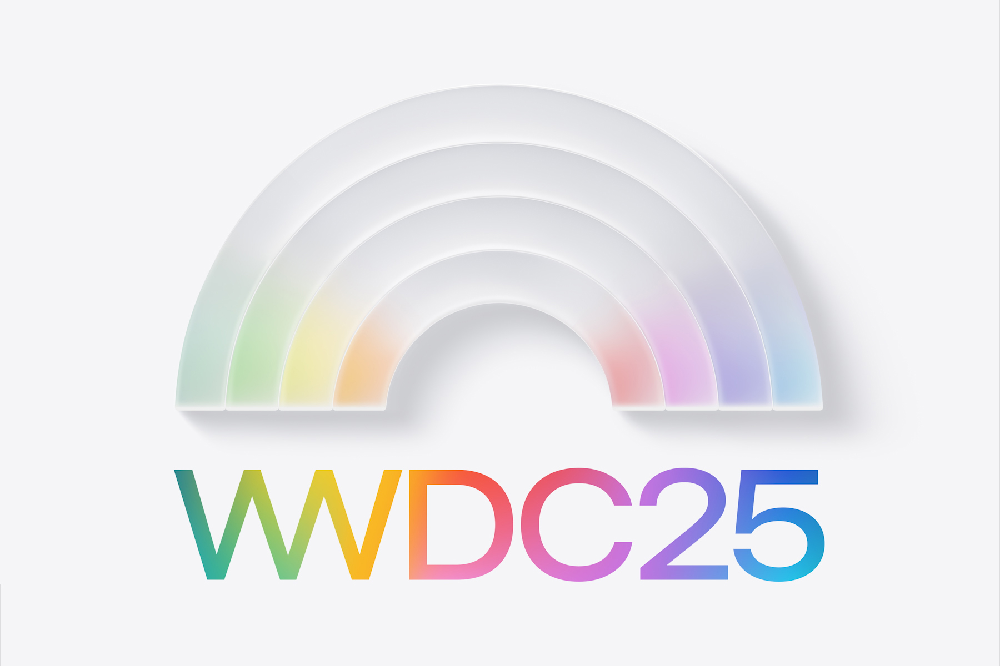

# WWDC25 Playground

## Overview

This repository serves as an experimental playground for exploring and demonstrating the groundbreaking technologies introduced at Apple's WWDC 2025. Here you'll find hands-on demo projects, code samples, and practical implementations of the latest Apple frameworks and APIs using Xcode 26.

## Demo Projects

*Coming soon...*

## Gems from WWDC25

### 🎨 Liquid Glass Design System
Explore Apple's revolutionary new UI material that combines glass-like optics with fluid, responsive interactivity:
- Custom controls with `glassEffect` modifier
- Glass button styles and toolbar customizations
- Dynamic app icons with Icon Composer
- Background extension effects for immersive experiences

### 🧠 Apple Intelligence & Foundation Models
Harness the power of on-device AI with Apple's new Foundation Models Framework:
- Local LLM integration for text processing
- `@Generable` Swift data structures for structured AI output
- Tool calling with autonomous Swift functions
- Privacy-first, offline AI capabilities

### ⚡ Swift 6.2 Performance Features
Leverage the latest Swift language improvements:
- Inline arrays for stack-based performance
- Span type for safe memory operations
- Enhanced concurrency with main actor defaults
- Improved C++ interoperability

### 📱 SwiftUI & Platform Updates
Modern UI development with enhanced SwiftUI capabilities:
- Declarative `WebView` integration
- Rich text editing with attributed strings
- 3D charts with RealityKit integration
- Cross-platform consistency across iOS, iPadOS, macOS, watchOS, and visionOS

## Resources

- [WWDC 2025 Session Videos](https://developer.apple.com/videos/wwdc2025/)
- [Apple Developer Documentation](https://developer.apple.com/documentation/)
- [Foundation Models Framework](https://developer.apple.com/documentation/foundationmodels)
- [Liquid Glass Design Guidelines](https://developer.apple.com/design/human-interface-guidelines/)

## License

This project is licensed under the MIT License - see the [LICENSE](LICENSE) file for details.

---

*Exploring the future of Apple platform development, one demo at a time.* 🚀
